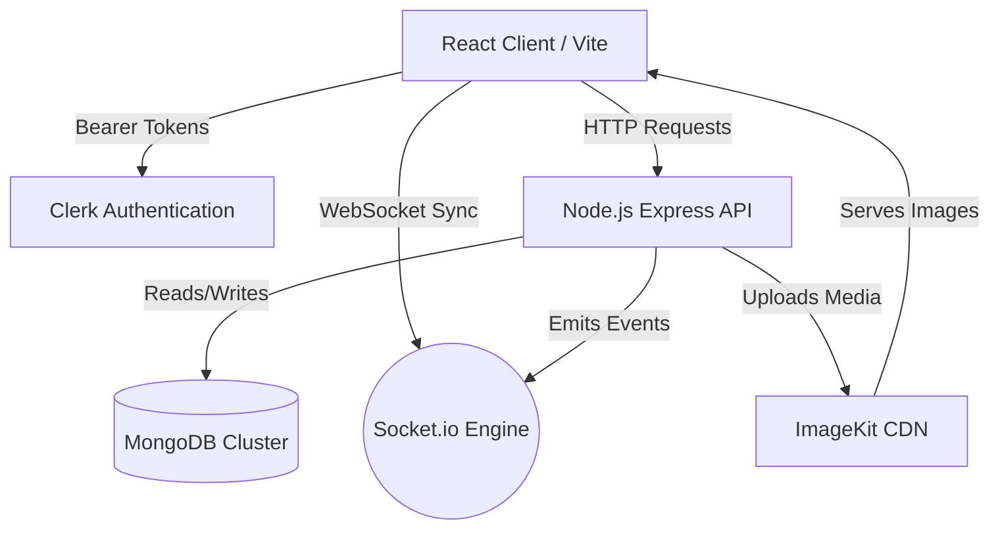
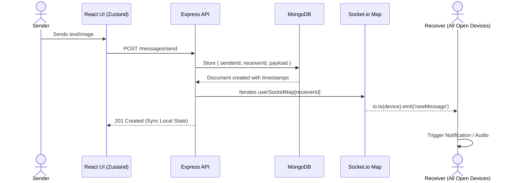

# iMessage Web Clone

A full-stack, real-time messaging application designed to replicate the sleek aesthetics and responsive functionality of Apple's iMessage. Built with modern web technologies, this platform supports live texting, multi-device socket syncing, image/video sharing, and read receipts.

## 🏗️ Architecture & Tech Stack



This project is structured as a mono-repository containing two distinct applications: a React frontend and a Node.js API backend.

### **Frontend** (`/frontend`)
- **Core Framework:** React 18 powered by Vite for lightning-fast HMR and optimized production builds.
- **State Management:** Zustand, providing lightweight and unopinionated global state handling (e.g., `useChatStore`, `useAuthStore`).
- **Styling:** Tailwind CSS combined with `@heroui/react` for accessible, premium UI components and modern dark/light mode theming.
- **Animations:** Framer Motion for buttery smooth message bubbling and layout transitions.
- **Real-Time Engine:** `socket.io-client` for seamless 2-way event syncing with the backend.

### **Backend** (`/backend`)
- **Server:** Node.js with Express framework.
- **Database:** MongoDB orchestrated via Mongoose ORM.
- **Real-Time Engine:** `socket.io` for maintaining highly efficient, multi-device socket maps.
- **Authentication:** Clerk for highly secure, seamless multi-provider user authentication.
- **Media Storage:** ImageKit integration serving as a lightning-fast CDN pipeline for image and video message attachments.

---

## 📂 Project Organization

```text
IMESSAGE/
├── backend/
│   ├── src/
│   │   ├── controllers/      # Route handlers (auth, messages, etc.)
│   │   ├── lib/              # Core utilities (db connector, imagekit, socket.io setup)
│   │   ├── middleware/       # Express middlewares (multer uploads, auth guards)
│   │   ├── models/           # Mongoose schemas (User, Message)
│   │   ├── routes/           # Express router definitions
│   │   └── index.js          # Main Express server entry point
│   ├── .env                  # Backend environment secrets
│   └── package.json
│
└── frontend/
    ├── src/
    │   ├── components/       # Reusable React components (ChatSpace, Navigation, etc.)
    │   ├── hooks/            # Custom React hooks (e.g., useScrollToBottom)
    │   ├── lib/              # Client utilities (Axios instance, time formatters)
    │   ├── pages/            # Top-level Page components (ChatPage, Auth filters)
    │   ├── store/            # Zustand global state slices
    │   ├── App.jsx           # Root layout and theme provider injection
    │   └── main.jsx          # React DOM mounting
    ├── .env                  # Frontend environment variables
    ├── index.html            # Vite HTML template
    ├── tailwind.config.js    # Design system tokens and plugins
    └── package.json
```

---

## ⚡ Core Features & Lifecycle

### **1. Real-Time Socket Architecture**



Whenever a user logs in, the backend authorizes the socket connection and registers the user's `socket.id` into an array-based `userSocketMap`. This sophisticated approach natively supports **Multi-Device Synchronization**, allowing a single user to chat simultaneously from their desktop and mobile seamlessly without dropped events.

### **2. Advanced Message Rendering**
Sending a message executes via high-performance optimistic UI updates:
- Text is pushed to the React UI array instantly.
- Behind the scenes, Axios commits the payload to the MongoDB cluster.
- When the recipient's socket receives the `"newMessage"` emission, their local Zustand store merges the new payload via closure callbacks to perfectly prevent stale-state race conditions.

### **3. Rich Media Attachments**
Image and Video files are intercepted via `multer` locally before being piped directly into the ImageKit SDK. URLs are subsequently mapped to the Message schema for lightning-fast frontend delivery.

### **4. Interactive User Gestures**
PWA-grade integrations such as macOS/Windows Native Desktop Notifications and dynamic typing audio (`keystroke1.mp3`) rely on explicit user gesture tracking natively bound to the sidebar component selection.

---

## 🚀 Getting Started

### Prerequisites
- Node.js (v18+)
- MongoDB URI Cluster
- Clerk API Keys
- ImageKit Keys

### Local Development
1. Navigate to both `/frontend` and `/backend` and install dependencies:
   ```bash
   cd frontend && npm install
   cd ../backend && npm install
   ```
2. Populate the `.env` files in both directories according to your service providers.
3. Start the Vite UI and Express Server simultaneously:
   ```bash
   # In Terminal 1
   cd backend && npm run dev

   # In Terminal 2
   cd frontend && npm run dev
   ```

*(This project is fully container-ready, equipped for zero-downtime deployment platforms like Render or Vercel.)*
