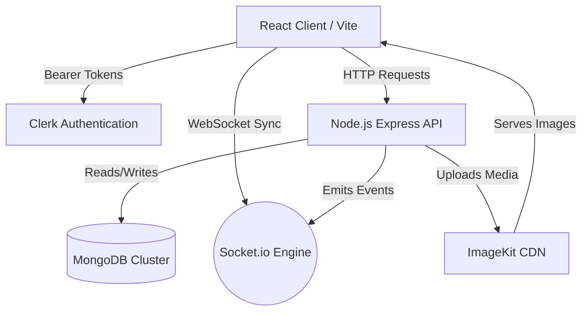
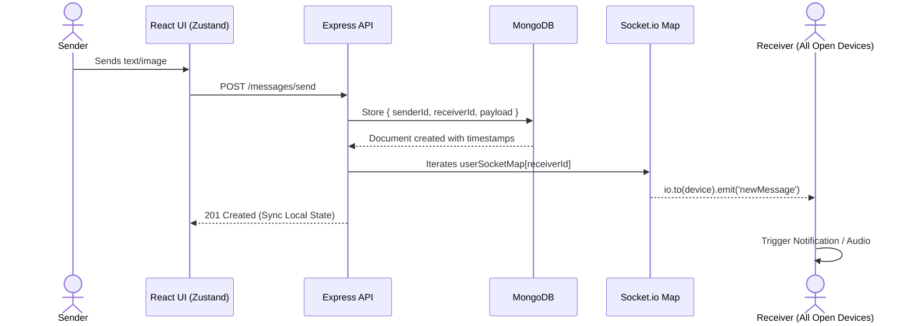

# iMessage Web Clone

A full-stack, real-time messaging application designed to replicate the sleek aesthetics and responsive functionality of Apple's iMessage. Built with modern web technologies, this platform supports live texting, multi-device socket syncing, image/video sharing, and read receipts.

This document serves as an exhaustive reference guide. By following this architecture map, any developer can rebuild, fork, scale, and successfully deploy their own production-ready version of this platform.

---

## 🏗️ Architecture & Tech Stack



This project is structured as a mono-repository containing two distinct applications: a React frontend and a Node.js API backend.

### **Frontend** (`/frontend`)
- **Core Framework:** React 18 powered by Vite for lightning-fast HMR and optimized production builds.
- **State Management:** Zustand, providing lightweight and unopinionated global state handling (e.g., `useChatStore`, `useAuthStore`).
- **Styling:** Tailwind CSS combined with `@heroui/react` for accessible, premium UI components and modern dark/light mode theming.
- **Animations:** Framer Motion for buttery smooth message bubbling and layout transitions.
- **Real-Time Engine:** `socket.io-client` for seamless 2-way event syncing with the backend.

### **Backend** (`/backend`)
- **Server:** Node.js with Express framework.
- **Database:** MongoDB orchestrated via Mongoose ORM.
- **Real-Time Engine:** `socket.io` for maintaining highly efficient, multi-device socket maps.
- **Authentication:** Clerk for highly secure, seamless multi-provider user authentication.
- **Media Storage:** ImageKit integration serving as a lightning-fast CDN pipeline for image and video message attachments.

---

## 📊 Data Flow & Database Modeling

Our MongoDB database orchestrates entirely around two core schema models physically located in `/backend/src/models`:

### 1. `User` Model
```javascript
{
  email: String (Unique),
  fullName: String,
  profilePic: String (URL),
  clerkId: String (Unique, Foreign Key tied to Clerk Auth)
}
```
**Data Flow:** When a user logs in via the Clerk Frontend modal, the backend seamlessly verifies the status. If it's a first-time login, the user's data is instantiated in MongoDB. All future data lookups are sanitized using `.select("-clerkId")` to block leaking private auth IDs to the frontend array.

### 2. `Message` Model
```javascript
{
  senderId: ObjectId (Ref: User),
  receiverId: ObjectId (Ref: User),
  text: String,
  image: String (URL via ImageKit),
  video: String (URL via ImageKit),
  isRead: Boolean (Default: false)
}
```
**Data Flow:** The `getConversationsForSidebar` controller utilizes a highly complex MongoDB Aggregation Pipeline (`$match`, `$group`, `$lookup`, `$replaceRoot`). 
Rather than running expensive map/filter loops on millions of messages in Express, we mandate MongoDB natively group messages by unique chat pairs, calculate unread badges using `$sum`/`$cond`, sort by `lastMessageAt`, and attach the corresponding user profiles seamlessly.

---

## ⚡ Core Features & Lifecycle

### **1. Real-Time Socket Architecture**



Whenever a user logs in, the backend authorizes the socket connection and registers the user's `socket.id` into an array-based `userSocketMap`. This sophisticated approach natively supports **Multi-Device Synchronization**, allowing a single user to chat simultaneously from their desktop and mobile seamlessly without dropped events.

### **2. Advanced Message Rendering**
Sending a message executes via high-performance optimistic UI updates:
- Text is pushed to the React UI array instantly.
- Behind the scenes, Axios commits the payload to the MongoDB cluster.
- When the recipient's socket receives the `"newMessage"` emission, their local Zustand store merges the new payload via closure callbacks to perfectly prevent stale-state race conditions.

### **3. Rich Media Attachments**
Image and Video files are intercepted via `multer` locally before being piped directly into the ImageKit SDK. URLs are subsequently mapped to the Message schema for lightning-fast frontend delivery.

### **4. Interactive User Gestures**
PWA-grade integrations such as macOS/Windows Native Desktop Notifications and dynamic typing audio (`keystroke1.mp3`) rely on explicit user gesture tracking natively bound to the sidebar component selection.

---

## 📂 Project Organization

```text
IMESSAGE/
├── backend/
│   ├── src/
│   │   ├── controllers/      # Route handlers (auth, messages, etc.)
│   │   ├── lib/              # Core utilities (db connector, imagekit, socket.io)
│   │   ├── middleware/       # Express middlewares (multer uploads, auth guards)
│   │   ├── models/           # Mongoose schemas (User, Message)
│   │   ├── routes/           # Express router definitions
│   │   └── index.js          # Main Express server entry point
│   ├── .env                  # Backend environment secrets
│   └── package.json
│
└── frontend/
    ├── src/
    │   ├── components/       # Reusable React components (ChatSpace, Navigation)
    │   ├── hooks/            # Custom React hooks (e.g., useScrollToBottom)
    │   ├── lib/              # Client utilities (Axios instance, time formatters)
    │   ├── pages/            # Top-level Page components (ChatPage, Auth filters)
    │   ├── store/            # Zustand global state slices
    │   ├── App.jsx           # Root layout and theme provider injection
    │   └── main.jsx          # React DOM mounting
    ├── .env                  # Frontend environment variables
    ├── index.html            # Vite HTML template
    ├── tailwind.config.js    # Design system tokens and plugins
    └── package.json
```

---

## 🚀 Deployment Guide (Render / Vercel)

Deploying a mono-repository with dual Node.js paradigms (Vite client + Express API) requires dividing the builds. We recommend using **Render** or **Vercel**.

### 1. Backend Deployment (Render Web Service)
1. In Render, create a new **Web Service**.
2. Connect your GitHub repository.
3. **Root Directory:** `backend`
4. **Build Command:** `npm install`
5. **Start Command:** `node src/index.js` (Or `npm run start` if mapped in package.json)
6. **Required Environment Variables:**
   - `PORT`: (Often left blank; Render parses dynamic ports natively)
   - `MONGODB_URI`: Your MongoDB Atlas connection string.
   - `CLERK_SECRET_KEY`: To verify REST API requests securely.
   - `FRONTEND_URL`: URL of your deployed frontend below (vital for strict Socket.io CORS policies).
   - `IMAGEKIT_PUBLIC_KEY` & `IMAGEKIT_PRIVATE_KEY` & `IMAGEKIT_URL_ENDPOINT`: From your ImageKit developer dashboard.

### 2. Frontend Deployment (Render Static Site or Vercel)
1. Choose **Static Site** on Render (or import the frontend directory into Vercel).
2. Connect your GitHub repository.
3. **Root Directory:** `frontend`
4. **Build Command:** `npm install && npm run build`
5. **Publish Directory:** `dist`
6. **Required Environment Variables:**
   - `VITE_API_URL`: The URL generated from your deployed backend above (e.g., `https://imessage-backend.onrender.com`).
   - `VITE_CLERK_PUBLISHABLE_KEY`: Essential to mount the Clerk frontend Auth boundaries.

Once both services turn green, simply hit your Frontend URL. The React App will asynchronously query Clerk for authentication, initiate a global `io()` WebSockets handshake with your backend URL, and you're officially live!
